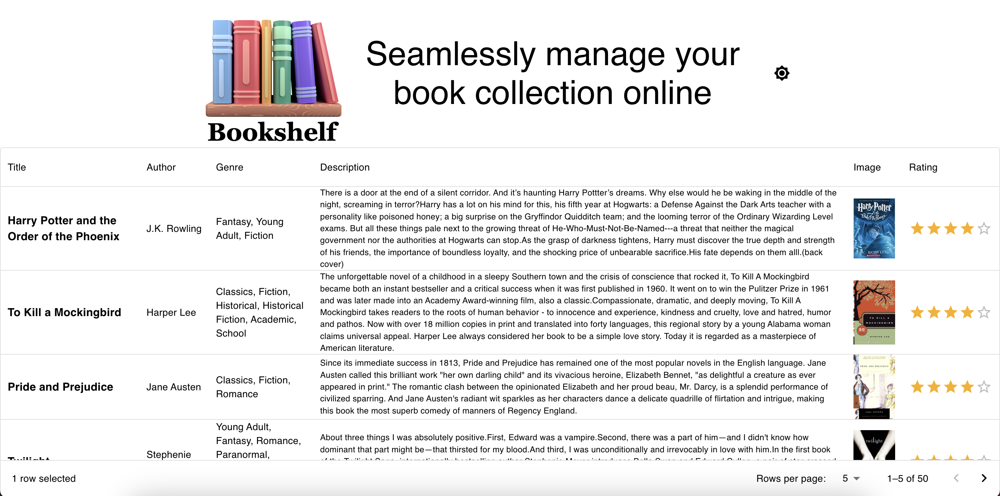

# Bookshelf 

This project, "Bookshelf", has been developed as a test assignment for a frontend developer position. It is a web application that allows users to manage their book collections.

## Technologies Used

- React: A JavaScript library for building user interfaces.
- Material-UI: A popular React UI framework that provides pre-designed components and styling.
- React Context: A state management tool for React applications.
- Draftbit REST API: The app uses a RESTful API for handling data communication with the server.

Visit the Bookshelf [Link to the **GitHub Pages**](https://vitland.github.io/bookshelf/)
